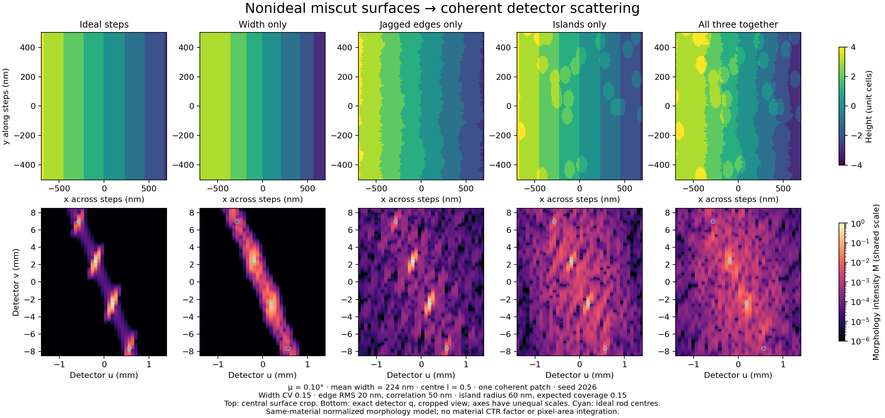

# CTR Surface Simulator

[Open the live simulator](https://xuanyizh.github.io/ctr-surface-simulator/) — no Python installation needed.

An interactive Python simulator for understanding how a real flat detector
samples crystal truncation rods through the elastic-scattering Ewald sphere.
The **Surface forward simulation** tab adds explicit terrace-width variation,
jagged step edges and islands, separately or combined, with coherent scattering
and reproducible exports. See [the surface model](SURFACE_MODEL.md) for assumptions.



Preview: each panel uses the same intensity scale; all three features combine
at the surface/amplitude level. Reproduce with `python compare_surfaces.py`
(optional plotting dependency: `matplotlib`).

## GitHub Pages deployment

`index.html` runs the Python app entirely in the browser using Stlite/Pyodide.
The first visit downloads the runtime; no local Python or separate application
server is required. Python code and calculations stay in the browser. Static
runtime assets are loaded from jsDelivr and Python packages from their package
hosts. These hosts must be reachable. Geometry downloads let you preserve work
before closing the tab.

Publish the root of `main` using GitHub Pages. The deployed files are
`index.html`, `app.py`, `physics.py`, `plots.py`, `surface_model.py`, and
`surface_ui.py`. The desktop Python source
uses the same geometry engine. Browser runtime: @stlite/browser 1.9.2.

Browsers without WebGL automatically use 2D projections. The sidebar
**Diagram mode** control switches between 3D and 2D. Projections can overlap
points with different omitted coordinates; use the access table for exact capture.

## Start on Windows, macOS or Linux

Use Python 3.10 or newer (tested with Python 3.12.14). Extract the ZIP completely.
Open a terminal or Anaconda Prompt **inside this folder** and run:

```bash
python -m pip install -r requirements.txt
python -m streamlit run app.py
```

On macOS/Linux, use `python3` if `python` is unavailable. In Anaconda, activate
your intended environment before installing and launching. Once dependencies
are installed, `start_windows.bat` or `start_mac_linux.sh` launches the app.
It runs on your computer and opens a local browser page; no online hosting is
needed. The initial package installation needs internet access. To stop it,
press Ctrl+C in the terminal. Windows 7 compatibility has not been tested.

## What you get

- Rotatable 3D real-space drawing: incident beam, selected outgoing beam, mean
  sample surface, step-edge direction, crystal axes, and flat detector plane.
- Rotatable full Ewald sphere with ki, kf, q, reciprocal origin, primary Bragg
  points and the selected family's sub-rods.
- Reciprocal-space close-up of the detector acceptance patch and intersections.
- A detector image with exact geometric peak markers and hoverable h,k,l.
- Linked pixel sliders: follow one pixel through all four views.
- Coordinate maps of h, k and l, and a local detector-to-hkl derivative table.
- Captured / missed intersection table; target hkl access check and one-button
  sample/detector alignment.
- Five examples: oblique, across steps, along steps, flat, and paper-like L=1.6.
- Geometry JSON and detector maps NPZ export, and geometry JSON import.
- A built-in explanation, coordinate conventions, equations and limitations.
- Explicit nonideal height maps: gamma/lognormal/truncated-normal widths,
  correlated noncrossing jagged edges, and same-material circular islands.
- Ideal/individual/combined detector comparisons on one shared scale, independent
  coherent-patch intensity averaging, height-map/settings/data export.

Start with **Oblique steps**. Switch the detector colour map to **l**. Then
compare **Across steps** with **Along steps**. Finally, try **Flat surface**.
The row index increases upward in the simulator; raw camera arrays may need a
vertical flip or detector-roll calibration before comparison.

## Essential distinction

The physical detector is flat. It does not physically cut a reciprocal-space
rod. Each pixel determines an outgoing direction. That direction gives
q = kf - ki and therefore a point on a **curved patch of the Ewald sphere**.
The reciprocal-space intersection maps back to a physical detector pixel.

## Coordinate conventions and equations

All wavevectors include 2π. Energy is in keV, wavelength/lattice in Å,
reciprocal vectors in Å^-1, detector dimensions in mm, coherence in µm.

- Lab +X is the incident beam direction; lab +Z is upward.
- Crystal x,y,z correspond to [100],[010],[001] for a cubic lattice.
- Crystal +x goes down the steps; step edges run along crystal y.
- Mean surface normal in crystal coordinates: ns=(sin μ,0,cos μ).
- Crystal to lab: R = Ry(-α) Rz(φ), applied to column vectors.
- α is a crystal tilt, **not always the actual grazing incidence**. The latter
  is asin(-ki_hat dot R ns), shown at the top of the app.
- Detector centre direction nD=(cos δ cos γ,cos δ sin γ,sin δ).
- Before roll, eu=(-sin γ,cos γ,0) and ev=nD cross eu. Roll rotates these axes
  about nD. The detector is perpendicular to the sample-to-centre ray.
- p=D nD+u eu+v ev; kf=(2π/λ)p/|p|; q_lab=kf-ki.
- q_crystal=R.T q_lab; (h,k,l)=a q_crystal/(2π).
- q-space Ewald sphere: |q+ki|=2π/λ, centre -ki, radius 2π/λ.
- Rod: q_lab=R G_hkL + t R ns, where G_hkL=(2π/a)(h,k,L).
- Solve the quadratic in t for exact rod/sphere intersections, then intersect
  the outgoing ray with the detector plane.
- At fixed crystal l: h_pixel=h_family+tan μ(l-L), k_pixel=k_family.
- Terrace width w=a/tan μ; adjacent sub-rods have |Δqx|=2π/w at fixed l.

The full Ewald plot has equal axis scales. The close-up has unequal scales to
make the small splitting visible. Mean surface size, step-line spacing in the
real-space overview and vector lengths are schematic. The physical detector
plane has its true dimensions; a separately labeled enlarged outline makes
it visible at a metre-scale sample distance. The terrace cross-section uses
real dimensions but greatly exaggerates the vertical plotting scale.

## Physics scope: two intensity models

**Linked views** retains the fast educational intensity described below.
**Surface forward simulation** computes a normalized coherent morphology factor
from explicit height maps, including speckle and intensity redistribution.
It is a separate approximate same-material forward model, not the closed-form
Ip/Iw/Is decomposition. See [SURFACE_MODEL.md](SURFACE_MODEL.md), especially the
different width statistics, coherence convention and convergence requirements.

The model is cubic, with single-cell steps and reflection from the top surface.
Only the chosen (h,k) family and displayed parent L range are considered.
The table predicts geometric access, not whether a material structure factor
makes that reflection observable. Refraction, multiple scattering and arbitrary
sample/detector orientation matrices are not implemented.

For nonzero miscut, the teaching image sums Gaussian transverse profiles,
weighted by the per-sub-rod relative factor in the paper's Eq. (17):

    w_L(l) = sinc(l-L)^2 exp[-(2π(l-L) σ_total/w)^2]

NumPy's sinc(x)=sin(πx)/(πx) is used. The common ideal-CTR intensity I0 is omitted,
so the image **does not compare absolute Bragg and anti-Bragg intensities**.
The Gaussian widths are set by inverse coherence, combined with an isotropic
approximation to pixel blur k*pitch/(sqrt(12)*distance). This is not exact pixel
integration, and very narrow, under-resolved rods need a finer model. At zero
miscut one Gaussian rod replaces all coincident sub-rods. The envelope for
non-specular families is illustrative. Peak centres are independent of this
brightness approximation and follow the exact geometry.

This is a simplified Ip-like model. It does not implement the full Eq. (12),
broad Iw from width fluctuations (Eq. 22), or diffuse Is from jagged edges
(Eq. 26). Thus changing the total roughness only damps distant-parent rods;
it does not redistribute the lost intensity into the omitted components.
No quantitative LaNiO3/SrTiO3 film structure factors, thickness fringes,
strain gradients, speckles or growth/XPCS time correlations are predicted.
Different q values select different Fourier components, not unique real-space
patches or a unique island size.

## Source audit

The two supplied PDFs are byte-identical copies of:

Trevor A. Petach, David Goldhaber-Gordon, Apurva Mehta, Michael F. Toney,
*Crystal truncation rods from miscut surfaces*, arXiv:1706.00484v1 (2017).
https://arxiv.org/abs/1706.00484

SHA256 of both supplied PDFs:
`ea0ecb273cf0fb81b3a1d59f08bd89175391a4db12f5bad15793490c032fa294`

Read: all 10 pages; Fig. 1 inspected visually. The supplementary material was
not attached. The key model inputs are Fig. 1, Eq. (6), Eqs. (12)-(17), and
Section III's description of area-detector acceptance on the Ewald sphere.
The paper uses cubic SrTiO3 with a=3.905 Å. Its experiment used 15.5 keV and a
detector at approximately 1 m. The paper-like preset uses that energy and the
Fig. 4 centre l=1.6, with illustrative miscut and detector dimensions.
The other presets use 10.16 keV and centre l=0.5 for a practical anti-Bragg
example. They are not a calibration of your instrument.

Streamlit chart API:
https://docs.streamlit.io/develop/api-reference/charts/st.plotly_chart

## Files

- `app.py`: interactive interface and built-in tutorial.
- `physics.py`: reusable calculations, independent of the interface.
- `plots.py`: linked Plotly figures.
- `surface_model.py`: reusable surface generator and coherent forward solver.
- `surface_ui.py`: nonideal-surface controls, comparisons and exports.
- `SURFACE_MODEL.md`: forward-model derivation, assumptions and usage.
- `test_physics.py`: physical and geometric validation checks.
- `test_surface_model.py`: independent Fourier and nonideal-surface checks.
- `test_app.py`: interface smoke tests.
- `VALIDATION.md`: checks performed and remaining limitations.

Run physics tests with `python -m unittest -v test_physics test_surface_model`.
Run interface tests with `python test_app.py`.
